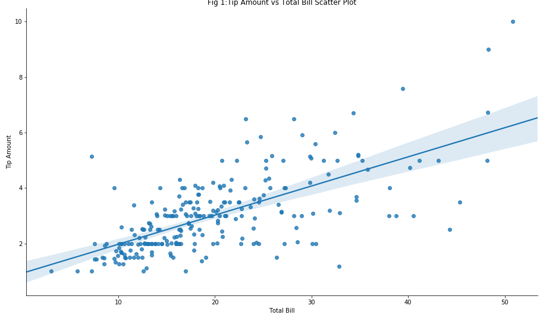
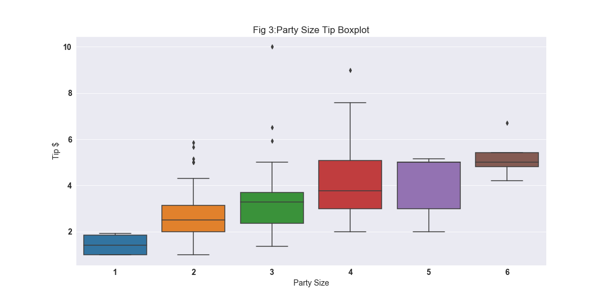
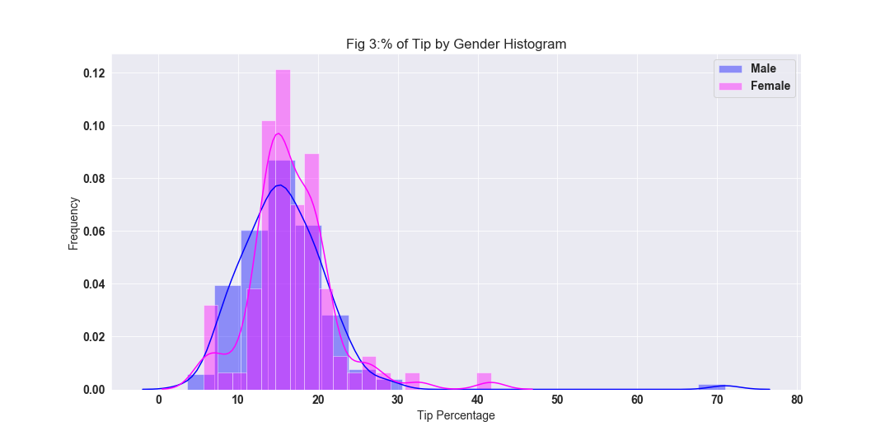
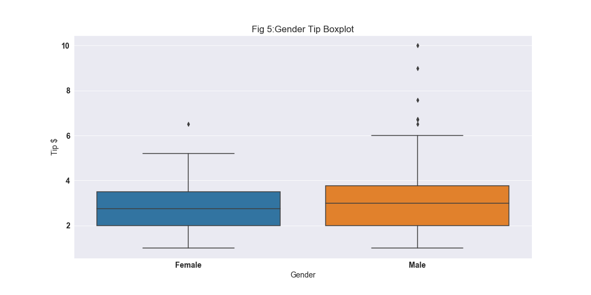
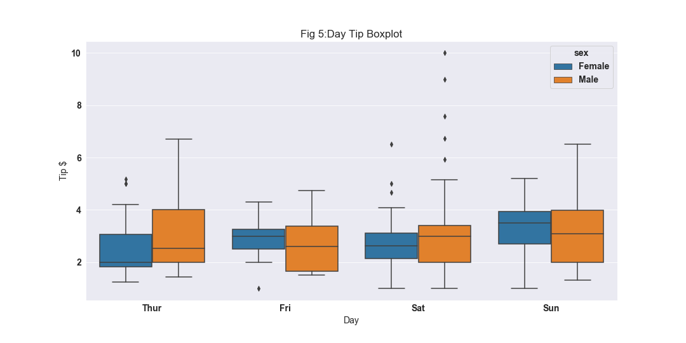
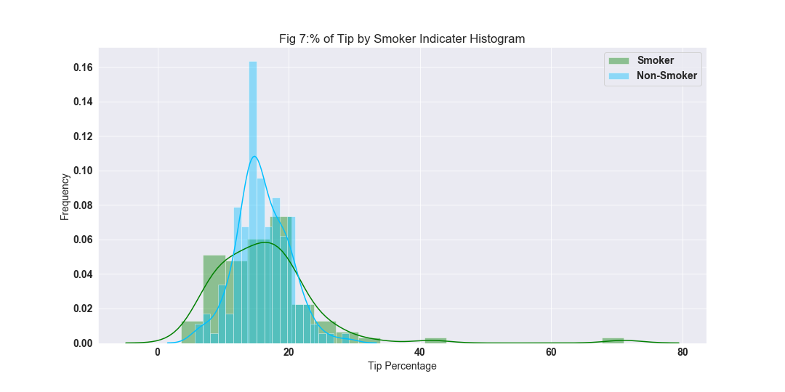
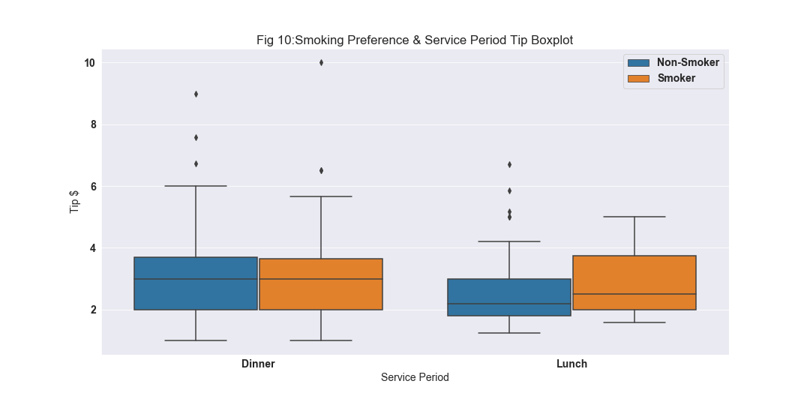

# FODA-Project-2019
Git Repository for Fundamentals Of Data Analysis Project 2019: Python Analysis of Tips Dataset 

## Running the Jupyter Notebook
1. Click this [link](https://github.com/Dowline1/FODA-Project-2019) for my Github repository.
2. Click the download button to save a copy of the repository on your machine.
3. Make sure you have Python installed including Jupyter, if you require installation please follow instructions in this [link](https://www.anaconda.com/distribution/) to download Python via Anaconda.
4. Use your command line such as CMDER to navigate to the folder housing the Git repository, download for CMDER found via this [link](https://cmder.net/).
5. Once in the folder type the command "Jupyter Notebook" and click enter.
6. This will open a Jupyter Notebook in your default web browser, click on the file "PFDA-Assignment-2019.ipynb".
7. Once in the Jupyter Notebook itself click on Kernel then Restart And Run All as per **image below**, this will run the code and generate all graphs.

## Introduction

The Tips Dataset originates from the early 1990's whereby over a period of ~ 3 months a food server recorded several variables (see below table for details) of the sales during the period.
The variables collected once analysed could give insight into the major factors which influence the amount of tips that are paid per bill. Using this knowledge restaurant management could make clear decisions on assigning servers to customers so that tips can be as evenly as possible distributed amongst staff as tips in the US play a major part of server earnings. 

&nbsp;

**Table 1:** **Variables Summary**

|**Variable**|**Details**|
|:-----:|:-----:|
|total\_bill|Total bill including tax in US $|
|tip|Tip amount in $|
|sex|Gender of person paying (Male/Female)|
|smoker|Indicates if smoker present in party (Yes/No)|
|day|Day of week (Thur/Fri/Sat/Sun)|
|time|Service Period (Lunch/Dinner)|
|size|Number of Individuals in Party|

&nbsp;

During the analysis I would expect there to be certain relationships between variables such as the total bill value and the tip amount as in the US it is an unspoken rule that a typical tip ranges from 10%-15% of the total bill. 

The relationships that I am interested in investigating include whether any of the other variables like gender, smoking preference, day of week or service period impact the amount of tip paid. In some cases there may be a relationship between tip paid and the party size to a point, however I expect that as is the case in some restaurants in Ireland a service charge can apply that can be up to 10% depending on the party size as can be seen in this [article](https://www.irishtimes.com/life-and-style/food-and-drink/before-you-leave-a-tip-in-an-irish-restaurant-read-this-1.3857096) which may add a bias to the analysis.

## Regression Analysis
The Tips Dataset is quite a simple array of data, it does however give some very interesting insight into the different factors that can influence both the % tip of a bill and also the amount of tip that a server can receive during a typical service period.

  
At a high level the first thing to understand from my analysis is whether a relationship actually existed between the amount of tip received and the total bill for the meal, figure 1 below show a scatter-plot comparing the total bill and the tip amount with regression line added to highlight any relationship with the two variables. 

As can be seen in the plot the regression line is a straight one that increases as it travels along the x-axis. This indicates a linear relationship between the two variables as was expected as the general rule of thumb is around a 10% tip of total bill in Ireland anyway. 

## Party Size Analysis
Once I completed my initial analysis into regression between the variables total bill and tip, I moved on to analyse which party size tipped a higher amount. My initial line of thought was narrow in that I assumed it would be obvious that larger party sizes ordered more food and in turn had a larger tip. For the most part this is true as can be seen below in fig 3, however there is a bit of an anomaly in that the tip amount was practically the same between party sizes of 4 and 5. 

It looks like once you get to a party size of 4 or more the rate at which the tip increases seems to slow as they tip around the same amount which is where I can see why there may be a requirement for a service charge. Once a certain party size is achieved this charge will be introduced as you need more servers to facilitate a party of this size but the tip must then be split between the servers resulting in quite a low amount of tip per person.

## Gender Analysis 
After analysing what I suspected would be the most obvious influencer on the tip amount is the party size, I then moved onto analysing which of the two genders gave there servers a better tip. Initially I thought that it would be best to analyse the differences based on the % of tip against the total bill which did indicate that percentage wise females did tip a higher amount. This can be seen in the below histogram fig 4 where the female peak was both taller and tighter indicating a larger and more consistent tip % by the female population. 

After some additional research however into others that had analysed the tips dataset, it got me thinking from a servers perspective it is all about the amount of tip rather than statistically who tips higher. So although I found it interesting in determining what gender have a higher % of tip I created some additional plots that looked at the amount of tip that was received broken out by gender of the person paying the bill which is illustrated below in fig 5. The box plot shows that male customers gave a larger tip amount compared to the females, this could be down to more the larger population of male customers as the females are tipping higher tip percentages compared to the total bill. 

## Gender & Day Analysis
Further analysis was then completed that looked at days of the week and how the genders compared against each other depending on what day of the week they attended the restaurant. From this fig 6 was created in the Jupyter Notebook and again saw the males again giving more of a tip than the females with interestingly Thursday being the day giving the hightest tip amount of the weekly service. Saturday on the other hand has quite a large variance in the tip amount for males as the outliers range greatly across the Y axis.

## Smoking Preference Analysis
The next and final part of my investigation into the Tips Dataset was on analysing whether smoking preference played a role in the tipping habits of customers attending the restaurant. I created a histogram plot to look at a high level if the % of tip could give an insight which revealed that the non-smoking customers seemed to be tipping a higher percentage compared to there total bill as can be seen in fig 8.

I then moved on to gain a little more insight by investigating if a combination of smoking preference and the period of service had any influence on the amount of tip received. Fig 10 shows a boxplot of this combined data of smoking preference and service period, it indicates that of the two service periods that during lunch time the smoking customers actually tipped more than there non-smoking counterparts. There could be some sort of social element to this in that they could be in a better mood and more generous as a result but it would be a hard theory to prove and may not in fact be a true influencer on the tip amount.

## Conclusion
In conclusion I did a lot of additional plots and investigation into the tips dataset that is not represented in this readme file, additional details of these plots and commentary can be found in the accompanying Jupyter Notebook which can be rerun as per the instructions at the start of this file. 

It can be difficult for management and unsettling for servers in the restaurant business to ensure that the tips accumulated are both fairly distributed and encourage great customer service. This analysis however can give some insight to management and some assurances to anxious servers that they have a voice and that fair tips distribution will be possible by targeting those falling behind in tips with some simple profiling of there customers.

To summarise party size may be the simplest element to identify and results in higher tips for the servers, following this targeting male paying customers can help to boost a servers tips as they seem to be tipping more than the females. Finally another good option for those falling behind in the tips they are receiving is to serve smoking customers during the lunch service which can result in a nice boost for servers that feel they are not being fairly tipped.

On another note management could use this information to there advantage to drive customer service levels by rewarding those servers who go the extra mile in terms of customer service with the customers who from this analysis seem to tip higher so that this can encourage some friendly competition  while helping the restaurants reputation. Another variable which I noticed was not part of the dataset but would be interesting should a follow up be conducted I think should be whether the server was male or female, this might give some insight to whether male customers tip female servers better than they would males and would give a totally different dynamic to the analysis.

## References
- tips.csv downloaded from this [link](https://github.com/mwaskom/seaborn-data/blob/master/tips.csv)
- Mukul Chauhan example analysis of tips dataset [link](https://medium.com/@mukul.mschauhan/data-visualisation-using-seaborn-464b7c0e5122)
- Tips Dataset Background Information [link](http://www.ggobi.org/book/chap-data.pdf)
- Case Study of Restaurant Tipping [link](https://dicook.public.iastate.edu/stat503/05/cs-tips2.pdf)
- Markdown Cheatsheet [link](https://github.com/adam-p/markdown-here/wiki/Markdown-Cheatsheet#headers)
- Underlining in Markdown [link](https://stackoverflow.com/questions/44840416/how-to-make-a-word-underline-in-markdown)
- Blank Rows/Additional Formatting in Markdown [link](https://dotcms.com/docs/latest/markdown-syntax)
- Plot Descriptions Seaborn [link](https://towardsdatascience.com/data-visualization-using-seaborn-fc24db95a850#targetText=Seaborn%20is%20a%20Python%20data,attractive%20and%20informative%20statistical%20graphics.)
- Statistics Quartiles Definition [link](https://www.investopedia.com/terms/q/quartile.asp#targetText=Q1%20tells%20us%20that%2025,the%20scores%20are%20above%2075.)
- Descriptive Statistics Information [link](https://www.investopedia.com/terms/d/descriptive_statistics.asp#targetText=Descriptive%20statistics%20are%20brief%20descriptive,measures%20of%20variability%20(spread).)
- Determining Relationships between variables [link](https://machinelearningmastery.com/how-to-use-correlation-to-understand-the-relationship-between-variables/)
- Regression Analysis [link](http://www.turingfinance.com/regression-analysis-using-python-statsmodels-and-quandl/)
- Sample Size Calculator [link](https://www.surveysystem.com/sscalc.htm)
- Exploring Data with Python [link](https://data-and-design.readthedocs.io/en/latest/02-introPandas.html)
- Analysis into Tips Dataset [link](https://towardsdatascience.com/analyze-the-data-through-data-visualization-using-seaborn-255e1cd3948e)
